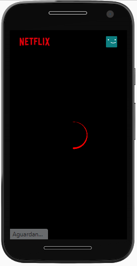
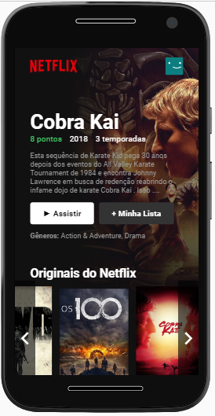
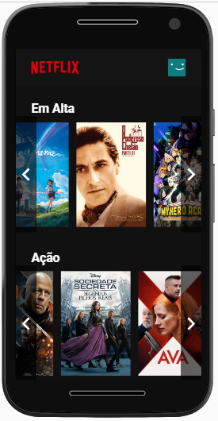
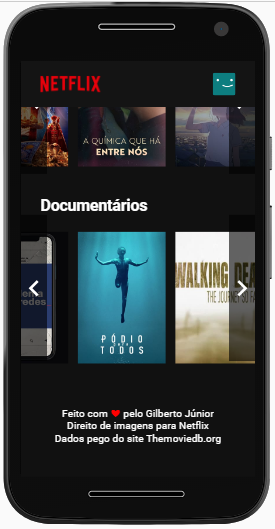
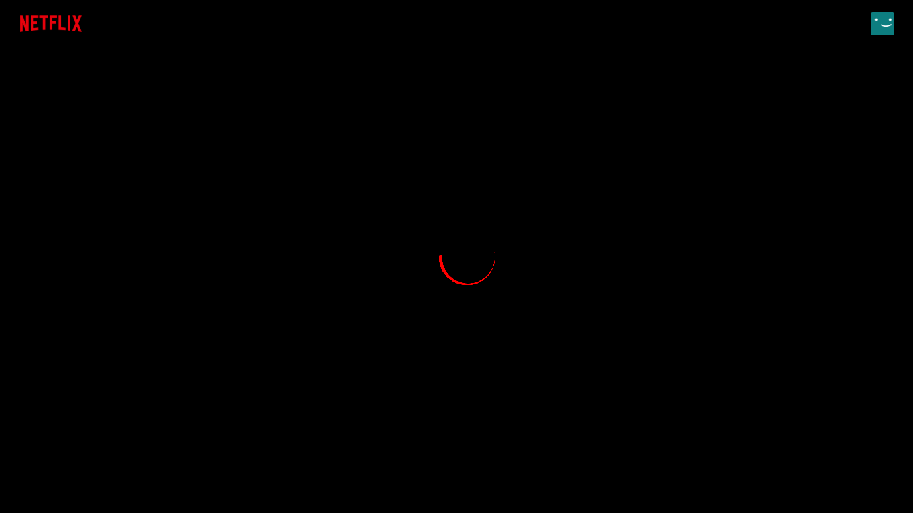
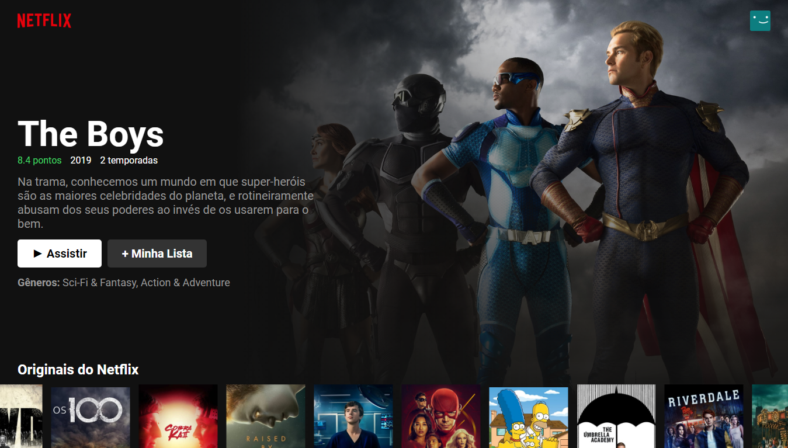
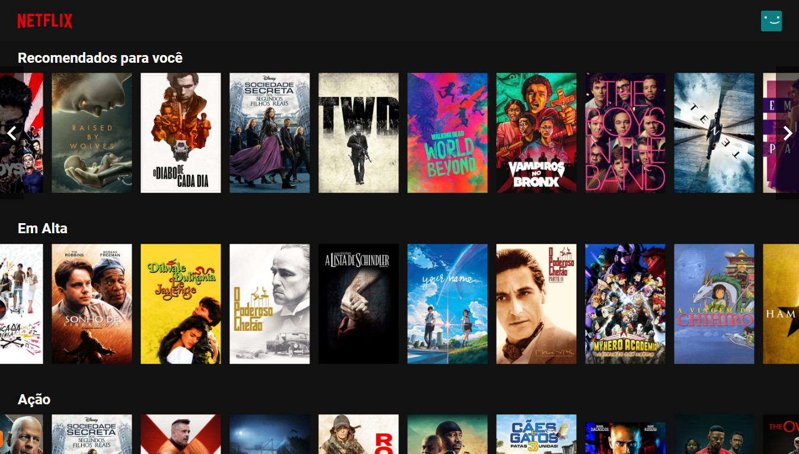
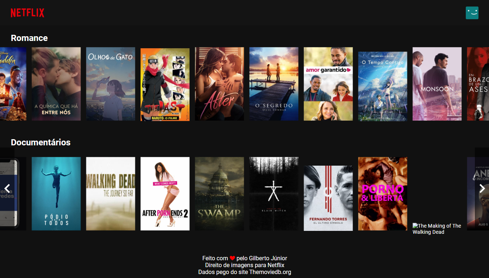

# Netflix - UI Clone Interface

# 📔 Sobre

Projeto reacriando a página inicial da Netflix Browser e Netflix Mobile.

Nesse projeto o instrutor nos ensinou a recuperar os filmes por categoria.
    
    Originais do Netflix,
    Recomendados para você,
    Em Alta,
    Ação,
    Comédia,
    Terror,
    Romance,
    Documentários

[Netflix](https://www.netflix.com/browse) com o ReackJs e CSS puro.

---
# 🌎 API
## API Desenvolvida com: 

    ReactJS
    

---

## Dependências: 

    @material-ui/core: ^4.11.0,
    @material-ui/icons: ^4.9.1,

---

## Após fazer o clone do projeto, no diretório do projeto, você pode executar: 

### `npm start` ou `yarn start`

Ao executar o aplicativo, o projeto vai abrir automaticamente no endereço http://localhost:3000.

Qualquer edição que você fizer no arquivo, a página sera recarregada.

Você também verá os erros no console.

---
## 📱 Versão Mobile

## 💻 Web

---
<h1 align="center">💻 Desenvolvido Por: Gilberto Júnior</h1> 